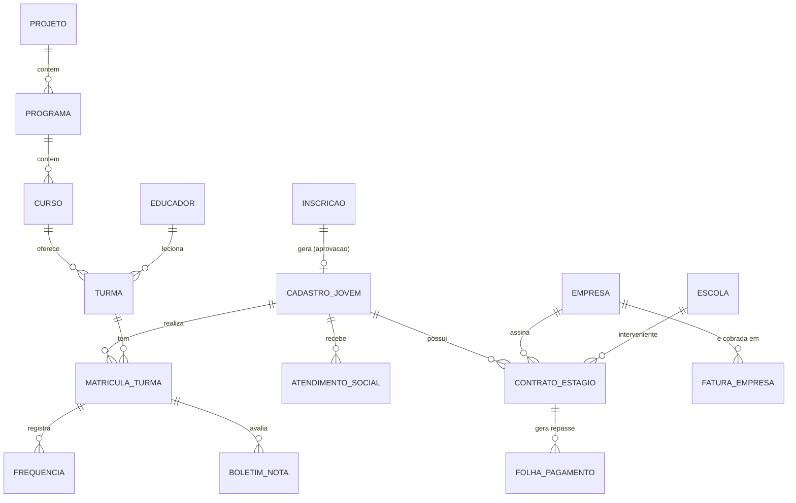

# Documentação do Sistema - ERP Jovem Aprendiz

Este documento descreve a arquitetura, configuração e as principais lógicas de negócio do **ERP Jovem Aprendiz - Patrulheiros Campinas**.

---

## 1. Visão Geral da Aplicação

O sistema é um ERP (Enterprise Resource Planning) focado na gestão do programa Jovem Aprendiz. Ele gerencia jovens, inscrições, educadores, projetos, programas, contratos, folha de pagamento, entre outras entidades.

**Tecnologias Utilizadas:**
- **Frontend:** React (com Vite), TypeScript, React Router, Axios, Lucide React (ícones), Zod (validação).
- **Backend:** Node.js, Express, TypeScript, MySQL (usando pacote `mysql2`), Passport.js (autenticação).
- **Banco de Dados:** MySQL.

---

## 2. Configuração e Deploy na VPS

A aplicação está hospedada em uma VPS rodando Linux (Ubuntu/Debian) e utiliza o NGINX como proxy reverso, além do PM2 para gerenciar o processo Node.js.

### 2.1. Estrutura e Ferramentas
- **Diretório na VPS:** `/var/www/erp_aprendiz`
- **PM2:** Gerenciador de processos que mantém a aplicação rodando continuamente (processo `erp-aprendiz`).
- **NGINX:** Recebe as requisições HTTPS (porta 443) em `https://sys.patrulheiros.org.br` e repassa para a porta local `3000` (Node.js).

### 2.2. Variáveis de Ambiente (`.env`)
A aplicação depende de um arquivo `.env` configurado na raiz do projeto na VPS com os seguintes parâmetros chave:

```env
DB_HOST=localhost
DB_USER=root
DB_PASSWORD=sua_senha_do_banco
DB_NAME=erp_aprendiz
PORT=3000
JWT_SECRET=sua_chave_secreta_super_segura_2026
ADMIN_USER=admin
ADMIN_PASS=admin123

# Google OAuth20
GOOGLE_CLIENT_ID=seu_client_id.apps.googleusercontent.com
GOOGLE_CLIENT_SECRET=seu_client_secret
GOOGLE_CALLBACK_URL=https://sys.patrulheiros.org.br/api/auth/google/callback
FRONTEND_URL=https://sys.patrulheiros.org.br
```

### 2.3. Comandos de Deploy
Para atualizar o sistema na VPS e garantir que todas as variáveis de ambiente sejam recarregadas:
```bash
cd /var/www/erp_aprendiz
git fetch origin
git reset --hard origin/main

# Instalação e Build Backend
npm install
npx tsc

# Instalação e Build Frontend
cd frontend
npm install
npm run build
cd ..

# Reiniciar aplicação atualizando as variáveis de ambiente
pm2 restart erp-aprendiz --update-env
```

### 2.4. Express e Proxy Reverso
No backend (`src/index.ts`), configuramos `app.set('trust proxy', 1)`. Isso é essencial para que o Node.js identifique corretamente o protocolo (HTTPS) original da requisição quando está atrás do NGINX, evitando erros de redirecionamento durante o fluxo de autenticação.

---

## 3. Autenticação com Google OAuth 2.0

O fluxo de autenticação foi projetado para permitir login com contas institucionais do Google (ex: `@patrulheiros.org.br`).

### 3.1. Lógica no Backend (`passport.ts` e `auth.controller.ts`)
1. O usuário clica em "Entrar com Google" e é levado para a rota `/api/auth/google`.
2. O servidor usa a estratégia `passport-google-oauth20` para redirecionar o usuário à tela de login do Google.
3. Após a autenticação bem sucedida no Google, o usuário retorna para a rota de callback (`GOOGLE_CALLBACK_URL`).
4. O `auth.controller.ts` captura o perfil do usuário:
   - Extrai o `email` e gera um `displayName` (nome do usuário).
   - Consulta o banco de dados (`determinarNivelAcesso()`) para verificar a "role" associada ao e-mail (ex: `admin`, `educador`).
   - Assina um token **JWT** contendo `{ id, username, email, role }`.
5. O servidor faz um redirecionamento (Redirect HTTP) devolvendo o usuário para o frontend, na rota `${FRONTEND_URL}/login-success?token=<token_jwt>`.

### 3.2. Lógica no Frontend (`LoginSuccess.tsx` e `AuthContext.tsx`)
1. O componente `LoginSuccess` intercepta a URL e extrai o parâmetro `token`.
2. Para evitar uma chamada extra de API e possíveis problemas de concorrência (*race conditions*), o frontend decodifica o payload do JWT nativamente via `atob()`.
3. Extrai o `username` e a `role`.
4. Salva os dados no estado global e no `localStorage` via `login(token, user)` do `AuthContext`.
5. Executa um `navigate('/')` para direcionar o usuário para o Dashboard, liberando acesso ao restante do sistema.

---

## 4. Lógica de Validação e Máscara de CPF

A aplicação garante integridade de dados ao tratar de CPFs usando validação matemática rigorosa e máscaras visuais.

### 4.1. Máscaras (`frontend/src/utils/masks.ts`)
Quando o usuário digita no campo CPF, a função `maskCpf` é chamada no evento `onChange`.
- A função utiliza Expressões Regulares (`replace`) para remover tudo o que não é número e inserir a formatação padrão: `000.000.000-00`.

### 4.2. Validação Matemática (`frontend/src/utils/validation.ts`)
- O sistema usa a biblioteca externa **`cpf-cnpj-validator`**.
- Foi criada uma função `isValidCpf(value)` que retorna verdadeiro ou falso caso o CPF tenha os dígitos verificadores válidos.
- A biblioteca **Zod** é utilizada para validar o esquema completo dos formulários. Em `InscricaoSchema` e `JovemSchema`, existe um refinamento (`refine`) que não permite salvar o formulário caso o CPF retorne falso no `isValidCpf`.
- Visualmente, o campo de CPF no frontend fica com a borda vermelha se o CPF digitado estiver incorreto e um texto de auxílio é exibido.

---

## 5. Lógica da API de CEP (ViaCEP)

Para agilizar o cadastro de jovens e inscrições, o sistema possui autocompletar de endereços com base no CEP.

### 5.1. Serviço (`frontend/src/utils/viaCep.ts`)
Foi implementada a função `fetchAddressByCep(cep: string)`:
1. Ela remove todos os caracteres não numéricos do CEP digitado (`replace(/\D/g, '')`).
2. Se o tamanho for exatamente 8 caracteres, faz um requisição assíncrona HTTP GET para a API pública do ViaCEP: `https://viacep.com.br/ws/<CEP>/json/`.
3. Retorna os dados estruturados de `logradouro`, `bairro`, `localidade` (cidade) e `uf` (estado).

### 5.2. Integração nos Formulários (`Inscricoes.tsx` e `Jovens.tsx`)
- Durante a digitação, a função `maskCep` formata o texto para o padrão (`00000-000`).
- No mesmo evento de formulário, verifica-se a quantidade de caracteres numéricos do CEP. Ao chegar no 8º caractere, o script dispara `await fetchAddressByCep`.
- Se o endereço for encontrado, os campos de Rua, Bairro, Cidade e Estado (ex: `end_logradouro`, `end_bairro`) são preenchidos automaticamente, modificando o estado atual do formulário. Isso traz enorme conforto de uso para o usuário.

---

## 6. Telas e Usabilidade do Sistema

O sistema foi desenhado para ser intuitivo e rápido, focado em agilizar o trabalho administrativo da equipe do Patrulheiros. As principais telas e recursos incluem:

- **Dashboard:** Visão geral do sistema com atalhos e widgets estatísticos.
- **CRUD Padronizado (`CrudPage.tsx`):** A maioria das telas de cadastro (Jovens, Inscrições, Educadores, Empresas, Contratos, etc.) utiliza um componente unificado. Isso significa que o usuário tem uma experiência consistente: a tabela de listagem, barra de pesquisa e modais de formulário têm o mesmo comportamento visual em toda a plataforma.
- **Inscrições:** Tela focada no primeiro contato do Jovem com a instituição. Permite aprovar a inscrição, o que transfere automaticamente os dados para o cadastro principal do Jovem.
- **Jovens (Cadastro Principal):** Visualização detalhada do jovem, englobando dados pessoais, socioeconômicos e avaliações de vulnerabilidade, preparando-o para ser alocado em turmas e contratos.
- **Educadores, Projetos, Programas e Cursos:** Telas focadas na organização da estrutura de ensino, permitindo a gestão de módulos e disciplinas.
- **Módulo Financeiro (Folha de Pagamento, Faturas):** Telas focadas no faturamento das empresas parceiras e pagamento dos jovens. Possuem cálculos automáticos em tempo real (como dedução de descontos no valor bruto para preencher automaticamente o valor líquido) e permitem a geração de **Recibos em PDF** diretamente da interface.
- **Assistência Social:** Telas para registro de `Atendimentos Sociais` e preenchimento de `Questionário Socioeconômico`, funcionando como um prontuário digital e seguro dos jovens assistidos.

**Pilares de Usabilidade:**
- **Layout Responsivo e Limpo:** A estrutura em `Sidebar` lateral e `Topbar` facilita a navegação, deixando o foco nos dados do formulário principal.
- **Feedbacks Visuais e Instantâneos:** Uso extensivo do `ToastContext` para alertar o usuário sobre salvamentos bem-sucedidos ou erros do servidor (em português claro).
- **Formulários Interativos:** Validações de tamanho, formatações em tempo real (máscaras de CPF, RG, Telefone, CEP) e destaques visuais (bordas vermelhas para dados incorretos).

---

## 7. Banco de Dados e MER (Modelo Entidade Relacionamento)

A modelagem de dados (MySQL) foi estruturada para conectar toda a jornada histórica do jovem — desde a Inscrição, passando pelo acompanhamento de Assistência Social e frequência Acadêmica, até a sua inserção e fechamento no mercado de trabalho via Contratos.

### 7.1. Principais Tabelas Relacionais

1. **`inscricao_2026` / `cadastro_jovem`:** Tabelas centrais que armazenam a identidade e características dos Jovens. A Inscrição é o lead/contato inicial; o Cadastro é a entidade efetiva após aprovação.
2. **`educador` / `projeto` / `programa` / `curso` / `turma`:** Conjunto de tabelas da estrutura pedagógica.
3. **`matricula_turma` / `frequencia` / `boletim_nota`:** Tabelas de transição (muitos-para-muitos) que vinculam o Jovem (`cadastro_jovem`) a uma `turma`, registrando suas presenças e avaliações.
4. **`empresa` / `escola` / `contrato_estagio` (ou `contrato_aprendiz`):** Tabelas corporativas que formalizam o vínculo empregatício ou de estágio do jovem com o mercado de trabalho (empregadores e instituições de ensino).
5. **`folha_pagamento` / `fatura_empresa` / `evento_financeiro`:** Tabelas de controle de repasse financeiro, geradas a partir da vigência dos contratos ativos.
6. **`usuario` / `perfil_acesso`:** Tabelas para controle de ACL (Access Control List) do sistema.
7. **`atendimento_social` / `parecer_social`:** Tabelas do prontuário mantido pela equipe social.

### 7.2. MER - Diagrama de Relacionamento Simplificado

Abaixo o diagrama demonstrando as entidades *Core* (Principais) do sistema:


